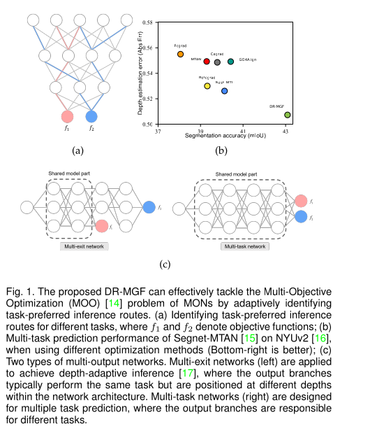
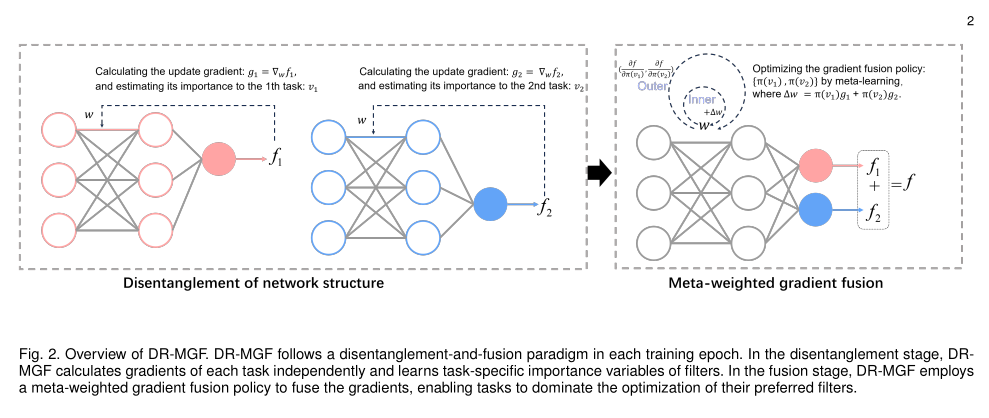

# Learning Task-preferred Inference Routes for Gradient De-conflict in Multi-output DNNs

Yi Sun, Xiaochang Hu, Xin Xu*, IEEE Senior Member , Jian Li*, Yifei Shi, and Ling-Li Zeng

Abstract—Multi-output deep neural networks (MONs) contain multiple output branches of various tasks, and these tasks typically share partial network filters, resulting in entangled inference routes between different tasks within the networks. Due to the divergent optimization objectives, the task gradients during training usually interfere with each other along the shared routes, which decreases the overall model performance. To address this issue, we propose a novel gradient de-conflict algorithm named DR-MGF (Dynamic Routes and Meta-weighted Gradient Fusion). Different from existing de-conflict methods, DR-MGF achieves gradient de-conflict in MONs by learning task-preferred inference routes. The proposed method is motivated by our experimental findings that the shared filters are not equally important for different tasks. By designing learnable task-specific importance variables, DR-MGF evaluates the importance of filters for different tasks. Through making the dominance of tasks over filters proportional to the task-specific importance of filters, DR-MGF can effectively reduce inter-task interference. These task-specific importance variables ultimately determine task-preferred inference routes at the end of training iterations. Extensive experimental results on CIFAR, ImageNet, and NYUv2 demonstrate that DR-MGF outperforms existing de-conflict methods. Furthermore, DR-MGF can be extended to general MONs without modifying the overall network structures





### 1. Install:

```shell
pip install -r requirments.txt
```

### 2. Dataset: 

The nyuv2 datasets can be downloaded from  https://pan.baidu.com/s/1lEI4ir0l0-MGx-fJt3c88g?pwd=cm3v extraction code: cm3v. If you employ this dataset in your work, please cite this work:"*C. Couprie, C. Farabet, L. Najman, and Y. Lecun, “Indoor semantic segmentation using depth information,” in First International Conference on Learning Representations (ICLR 2013), 2013, pp. 1–8.*"

Putting it at "./data/nyuv2"

```
nyuv2
├── train
│   ├── depth
│   ├── image
│   ├── label
│   └── normal
└── val
    ├── depth
    ├── image
    ├── label
    └── normal
```

### 3. Training Segnet-MTAN independently

```python
cd /home/XX/DR-MGF-MTL/E1_Multi_task/Script
./run_baseline.sh
```

### 4.Training Segnet-MTAN using DR-MGF

```python
cd /home/XX/DR-MGF-MTL/E1_Multi_task/Script
./run.sh
```

### 5. Show result

```python
cd E1_Multi_task/
python S1_show_delta_m.py #editing the path
```

### 6. Test

```python
cd E1_Multi_task/
python T0_test_transferSparseToCompact.py  #Transfer the sparse model into compact (original) model and test
python T1_test_on_nyuv2.py #Directly test the model performance
```


### 7. Applying Meta-GF /DR-MGF to a networks:

#### 7.1 Meta-GF

Please refer to  the readme.md in **F0_QuicklyApplication_MetaGF_ForMultitask**

#### 7.2 DR-MGF

We will writing a new readme file soon.


### Acknowledgements

We thanks for the public codes provided by the following works:

- Li, H., Zhang, H., Qi, X., Yang, R., Huang, G.: Improved techniques for training adaptive deep networks. In: Proceedings of the IEEE/CVF International Conference on Computer Vision. pp. 1891–1900 (2019)


- Kaya, Y., Hong, S., Dumitras, T.: Shallow-deep networks: Understanding and mitigating network overthinking. In: International Conference on Machine Learning.pp. 3301–3310. PMLR


- C. Couprie, C. Farabet, L. Najman, and Y. Lecun, “Indoor semantic segmentation using depth information,” in First International Conference on Learning Representations (ICLR 2013), 2013, pp. 1–8.

**This is the newest version**


